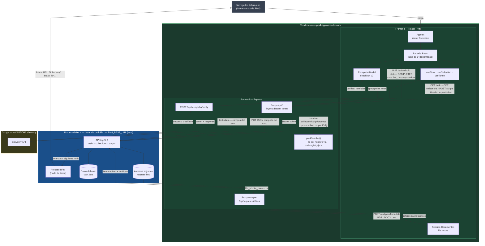

# Diagrama de integración — PM4 App

Arquitectura actual (frontend + backend/proxy + verificación reCAPTCHA + resolución de IDs
por nombre). Fuente Mermaid renderizada a
[`pm4_render_integration.svg`](pm4_render_integration.svg) con `@mermaid-js/mermaid-cli`.

